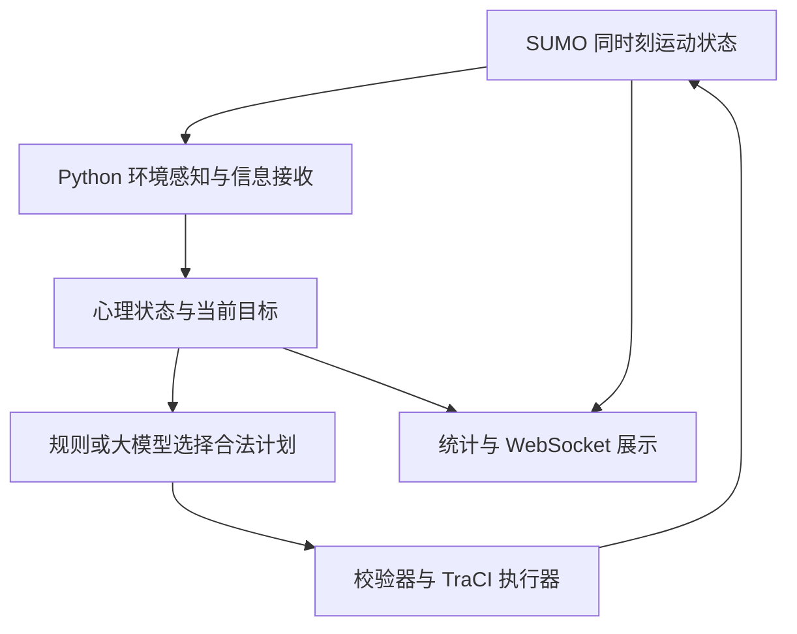

# crowdsim-backend：最终整体修改方案与功能验收规范

> 实施后的模块已迁入 `crowdsim/` 分层包。本方案中的原始平铺文件名按 `docs/工程目录与模块边界.md` 映射到 `domain`、`core`、`environment`、`decision`、`infrastructure`，功能要求不变。

适用仓库：MoonSinister/crowdsim-backend。源码核查基准：`ee6100fbb777a85da44fd49bda234dcd19d3568a`。日期：2026-09-08。

版本：最终整合版，合并已确认的系统运行方式、个体属性精简和语言简化。本文完整替代前序方案，不需要与旧版本拼接执行。

这是按已确认架构编写的实施规格，尚未修改仓库代码或完成 SUMO 迁移验收。文件和函数名称依据上述提交；实施前先核对后续提交差异。本方案替代此前关于本道路工程运动层的建议，与此前局部场景的 JuPedSim 研究独立。

## 1. 最终架构及边界

真正运行 SUMO，采用原生 `striping` 行人模型。Python 维护个体属性、心理、信息、目标及策略；规则和大模型通过同一个计划接口作出选择，执行器通过 TraCI 修改行人计划或速度上限。保留 WebSocket 消息名称、主要字段和经纬度展示方式。

- SUMO 唯一负责：行人和车辆的实际位置、实际速度、道路运动、避碰及出发到达。
- Python 唯一负责：画像、可知信息、内部状态、策略选择、事件管理、实验记录。
- 前端负责：展示和发送命令，不计算权威运动状态、不改变实验统计；若为画面平滑在相邻快照间插值，仅用于显示，不能反馈给仿真或作为研究数据。
- 路段密度由真实行人数和明确面积计算；停止使用事件密度倍率、虚构人口以及独立 LTM 密度覆盖。
- 研究对象是道路人流集中、排队、减速、堵塞和改道后的拥堵转移。不得将输出解释为身体接触力、踩踏或压力失稳。



保留旧启动文件 `crowdsim_overlay_server.py` 作为兼容入口；主实现改为 `SimulationRuntime`。不在运行时保留第二套位置更新作为“兜底”。SUMO 启动失败就报告错误。


### 1.1 本次最终交付功能

最终系统应能完成以下完整演示：加载现有道路 → 按时出发行人和车辆 → 查询每人的有效画像、观察、状态与目标 → 正常行走和活动停留 → 接收警报或指引 → 用规则或大模型选择等待、改道、换目标或会合 → SUMO 执行 → 观察真实人数与位置变化形成的排队和拥堵转移 → 导出可核查的实验结果。

| 功能 ID | 最终实现功能 | 交付范围 |
|---|---|---|
| F01 | 真实道路运动 | 原生 striping；人员、车辆状态由 SUMO 返回 |
| F02 | 人口生命周期 | 按 depart 出发、一人一实体、活动停留与最终离场分离、守恒账本 |
| F03 | 有效个体异质性 | 第 2.3 节属性清单全部有消费者；无效背景不参与计算 |
| F04 | 局部感知 | 邻居、密度、受阻、可见事件；不默认获知全局环境 |
| F05 | 压力与疲劳 | 随实际经历更新、同步提交、支持恢复 |
| F06 | 信息接收 | 范围、渠道、延迟、去重、失效、来源信任；收到即默认理解 |
| F07 | 自主目标和活动 | 在已知且可达的 POI 中选择、停留、再选择或离场 |
| F08 | 策略实际执行 | continue/slow_down/wait/reroute/change_goal 的完整执行与结果记录 |
| F09 | 同行协调 | 真实成员关系、已知会合点、有限等待及重新会合；不实现二维队形 |
| F10 | 规则/LLM 切换 | 同输入合同、候选和执行器；模型失败回退 |
| F11 | 决策调度 | 周期与事件触发、并发预算、公平性、失效结果拒绝 |
| F12 | 信息事件和引导 | 警报、传言、警察指引、推荐绕行、纯观察 |
| F13 | 危险输入与静态瓶颈 | 外部水情显示和显式速度约束、静态窄路场景；动态硬封闭不列为必交功能 |
| F14 | 拥堵观测 | 区域密度、速度、双向断面流量、受阻/等待、队列代理指标 |
| F15 | WebSocket 兼容 | 保留主要消息和字段，支持配置、启动、暂停、倍率、事件及状态查询 |
| F16 | 可回放实验 | 保存实际使用的输入、属性、决策和生效时间，回放不再调用模型 |
| F17 | 可比较实验 | 规则/LLM、同质/异质、同行开关等，保存配对输入和结果 |
| F18 | 可审计交付 | 文献—机制—消费者—参数—指标映射，测试报告和失败记录 |

F01—F18 均为完整交付要求。接入验证失败时应报告未完成项；不能只把功能开关关闭就判定完成。动态多边形障碍、运行中硬封路、完整视线遮挡、连续二维群体队形、多语言理解、火灾/水动力、身体接触力不在本次完成承诺中。前端传入未支持的物理操作必须明确拒绝。

## 2. 现有文件逐项修改

### 2.1 crowdsim_overlay_server.py：从仿真大文件改为入口

| 现有位置 | 操作 | 新位置和行为 |
|---|---|---|
| `PedestrianLtmCore` 整个类 | 从主运行文件移出 | 移到 `baselines/pednstream_runner.py`，独立入口、独立人口、独立指标；主程序不实例化 |
| `OverlayNetworkSimulator.__init__()` | 替换 | `simulation_runtime.py:SimulationRuntime` 初始化 SUMO、状态存储、事件、决策与输出模块 |
| `configure()` | 重写 | 验证启动前需求配置；运行后只允许调整播放倍率和推送频率；人数变更明确要求重建运行 |
| `step()` | 替换 | `SimulationRuntime.tick()` 完成一个严格时间边界的完整闭环 |
| `resolve_agent_decisions()` | 移除旧实现 | `decision_scheduler.py` 调度；`agent_decision.py` 产生计划；tick 内统一执行 |
| `_spawn_agent()`、`_ensure_population()`、`_target_count()`、`_augment_route_coverage()` | 删除旧逻辑 | `population_manager.py` 管理需求文件与生命周期；禁止中途随机补人、随机扩路 |
| `_advance_agents()` | 整段删除 | `sumo_adapter.py:step()` 推进；行人和车辆均从 SUMO 读回 |
| `_maybe_divert()` | 整段替换 | `route_provider.py` 生成合法路径；`plan_executor.py` 执行；不再单独替换 route 中的一条边 |
| `_update_segment_load()` | 替换 | `metrics.py` 从真实快照统计；删除 LTM 与个体统计混合取最大值 |
| `_update_agent_perception()` | 改为委托调用 | `crowd_environment.py:observe()`，只读取冻结快照 |
| `_event_density_multiplier()` | 删除 | 客观密度不受事件倍率改变 |
| `_policy_relief_factor()`、`_control_influence_on_segment()` | 删除旧效果公式 | `intervention_executor.py` 执行明确的消息或通行控制 |
| `set_event()`、`set_flood()`、`apply_policy()` | 保留外部入口，改为命令提交 | 统一入队，在 tick 边界校验、生效和记录 |
| `_water_influence_on_segment()`、`_decay_water()` | 替换 | `hazard_model.py`；水情按明确外部输入或配置演化，禁止警察引导自动降低水位 |
| `_refresh_flooded_roads()` | 移动并改造 | `frame_serializer.py` 输出叠加层；道路受影响范围由 hazard 模块提供 |
| `_agent_color()` | 移动 | `frame_serializer.py`，颜色只反映状态，不反向改变仿真 |
| `frame()` | 替换 | `FrameSerializer.build()`，不再调用折线插值加 lateral |
| `parse_args()`、`main()` | 保留并修改 | 增加 SUMO 配置、决策模式、随机种子和实验输出目录，负责启动和清理 |

确认需要消除的旧行为：`wait` 的非零运动、低速若干步后随机重定位、到达后自动补人、改道破坏连续路线、规则决策也只处理前 12 人。这些不能迁移为新系统默认行为。

### 2.2 crowdsim_models.py：分清真实状态和行为状态

| 数据类型 | 处理 |
|---|---|
| `Segment` | 改为地图与展示元数据；逐 lane 保存宽度、权限、形状；禁止只读第一车道；不保存第二套引擎运动状态 |
| `RouteTemplate` | 改为 `DemandRecord`：person ID、原始 depart、起点位置、行走阶段、目标、类型和来源 |
| `FloodZone` | 保留位置和范围，增加来源、更新时间和失效时间 |
| `CrowdEvent` | 去掉内部 `density_multiplier`；增加信息、物理影响的分离字段和事件版本 |
| `Agent` | 拆为下面五类；旧字段只通过兼容序列化提供 |

新增类型：

- `AgentProfile`：年龄、行动能力、自由行走速度、风险偏好、熟悉度、耐心、信息信任、社会关系、决策偏好；这些是个体长期属性。
- `MotionSnapshot`：SUMO 返回的 ID、类型、x/y、实际速度、朝向、所在边、车道位置、当前阶段、仿真时间；作为只读快照。
- `AgentState`：压力、疲劳、目标、活动状态、已知事件、消息记忆、等待截止时间、下次决策时间。
- `Observation`：可见邻居、局部密度、可见事件、已收到消息、已知路线情况、候选计划及快照版本。
- `BehaviorPlan`：动作、目标/路线候选 ID、有效期、依据快照、原因、来源、决策 ID。

同一 SUMO person 对应一名真实模拟行人，统计权重固定为 1。同行组用 `GroupRecord(group_id, member_ids, rendezvous_id)` 表示；旧 `group_size` 只代表实际同行组人数，不再放大人数。

### 2.3 cultural_profiles.py：最终属性清单与语言简化

新建 `population_profiles.py` 和 `config/population_profiles.json`；旧文件先作为转发兼容层，移除调用后删除。固定种子按稳定 person ID 抽样，避免属性受遍历顺序影响。

下表是本次实际启用的个体参数，不要求另外加入一整套性格量表。0—1 为建模归一化范围，不代表已测得的人格分数。

| 字段 | 含义/单位 | 唯一或主要消费者 | 验证方式 |
|---|---|---|---|
| `free_walking_speed` | 未受阻自由速度，m/s | 出发前 SUMO 类型配置、速度约束 | 无障碍场景下不同配置对应不同速度上限 |
| `mobility` | 行动能力比例，(0,1] | 统一能力上限计算，仅应用一次 | 同自由速度时降低能力使上限降低，不被重复相乘 |
| `perception_radius` | 邻域范围，m | `CrowdEnvironment.observe()` | 对象跨越范围边界后进出邻居集合 |
| `familiarity` | 初始场景熟悉度，0—1 | 初始化已知道路与 POI | 熟悉度改变初始知识，不直接读取全局实时密度 |
| `risk_tolerance` | 风险容忍度，0—1 | 规则候选代价、LLM 上下文 | 构造风险/时间冲突选项，检查规则评分方向 |
| `patience` | 等待耐心，0—1 | 受阻重评估阈值映射 | 同等阻挡下阈值不同，但不强迫必然改道 |
| `crowding_tolerance` | 拥挤容忍度，0—1 | 拥挤感/压力刺激计算 | 同客观密度下感受不同，密度数值不变 |
| `following_tendency` | 跟随可见选择倾向，0—1 | 基于已观察路线选择的候选评分 | 无可观察他人选择时不产生凭空跟随信息 |
| `authority_compliance` | 指引遵从倾向，0—1 | 已接收可信指引的计划偏好 | 无指引时不产生额外服从项 |
| `information_trust` | 各来源信任，0—1 字典 | 消息采信/决策上下文 | 同内容换来源可改变采信，送达事实不变 |
| `group_cohesion` | 同行关系重视程度，0—1 | 会合与等待候选代价 | 只对真实已知同行关系生效 |
| `stress_susceptibility` | 刺激敏感度，0—1 | `state_updater.py` | 同刺激条件下压力增量按规则变化 |
| `recovery_seconds` | 压力恢复时间尺度，s，>0 | `state_updater.py` | 刺激消失后恢复，禁止每步减固定无单位常量 |
| `endurance` | 耐力，归一化正值 | 疲劳积累/恢复规则 | 相同活动负荷下累积速率符合配置 |

避免冗余：本次不再独立启用 `crowding_avoidance`、`time_preference`、`help_seeking`、`mood`、`personal_space`、`queue_mode`、`counterflow_tendency` 等额外心理参数；时间/拥挤权重可使用实验级配置，避免继续扩张画像。身体尺寸采用登记的 SUMO 类型配置，本次不宣称实现异质体型机制。求助可通过已知服务 POI 表达，不单独增加人格维度。

背景信息可保留 `age_group`、`occupation`、`nationality`、`native_language`、`visit_purpose`。其中 visit_purpose 用于初始化活动候选；age_group 若用于抽样必须说明条件分布来源。职业、国籍、母语默认仅用于展示，不送入有效决策提示词，也不映射固定服从或恐慌系数。不要基于这些标签偷偷恢复文化参数表。

语言最终处理：删除 `language_proficiency`、`language_delay`、`symbol_accuracy` 等活动参数；默认所有收到消息的行人能够理解内容，不启用 `message_comprehension`。继续区分“是否收到”“是否相信”“是否行动”。未来只有专门进行理解差异实验才扩展语言机制。

动态状态统一为 `stress`、`fatigue`、`perceived_risk`、`perceived_crowding`、`blocked_duration`、`planned_wait_until`、`activity_state`、`known_events`、`received_messages`；已知地点与路线可以通过探索/信息更新。运动观察的 `local_density`、`nearby_people`、位置和实际速度不放入长期属性。

目标与关系包括 `current_goal`、`activity_plan`、`time_budget`、`group_id`、`companion_ids`、`rendezvous_id`、`current_plan`、`next_decision_time`。group_size 从成员计算，一人权重恒为 1。

新增 `config/attribute_registry.json`：每个字段登记定义、单位、范围、默认值、消费者、参数来源和测试 ID。默认值必须实际写入配置，不能依赖提示词自行解释。参数无实证来源时标为假设；规则评分可做方向测试，LLM 行为差异需要多次实验统计，不能要求一条提示一定产生指定选择。

### 2.4 network_adapter.py：保留坐标与元数据，替换路网解析

- `SumoNetAdapter.load()` 使用 `sumolib.net.readNet(..., withInternal=True)` 为基础，完整保存边和车道信息；walkingarea、crossing 的加载结果做数量核对，不能只凭参数假定齐全。
- `_parse_edge()` 删除“只使用第一个 lane”和排除内部边的逻辑，区分导航边、内部连接和展示边。
- 行人可达性使用行人权限及双向行走语义，不能复用机动车 outgoing 图直接判断。
- `xy_to_lonlat()`、`lonlat_to_xy()` 统一到 SUMO 路网投影接口；将原 pyproj 结果作为对照检查，避免重复减 netOffset。初始化中心仍输出 `[lat, lon]`，个体字段仍是 `lng/lat`。
- `point_at_distance()` 仅可用于静态路段展示，运行时不得用于生成 Agent 位置。
- `load_pedestrian_routes()`、`load_vehicle_routes()` 改为需求审计/预处理；不再默默删除不认识的边拼成新路线。
- `thin_points()` 等展示工具保留。新增 `get_walkable_lane_metadata()` 和内部边到展示道路的映射；即使映射失败，也必须保留并展示该人的原始坐标。

地图质量报告应包含权限、宽度来源、路口设施、连通分量、不可达需求和坐标检查结果。已有 walkingarea/crossing 不等于宽度和连通性已经正确。

### 2.5 crowd_environment.py：只计算观察，不推进位置

- `update_perception()` 替换为 `observe(snapshot, previous_states, events, information)`，返回 observation 集合，禁止原地修改 Agent 压力。
- 删除 `event_density_multiplier()`。`event_influence()`、`event_effects()` 改为分别计算可感知刺激和外部危险，不修改人口统计。
- 邻居通过空间索引筛选，并利用步行设施拓扑排除隔街、立交等无直接互动关系的对象；只有二维地图时，不能宣称实现了完整视线遮挡。
- 邻居人数按 person ID 去重；心理传播只使用邻域中上一时刻的状态，禁止整条长路段压力平均。
- `classify_density()` 拆分客观密度分档和个体拥挤感，个体容忍度不改变客观密度。
- `density_counts()` 从最新 observation 统计，只统计行人。

密度口径：路段密度为该统计区域内实际人数/可行走面积；局部密度为行人邻域与可行走区域交集中的人数/交集面积。面积由已有 lane 宽度、形状和 walkingarea 形状构建统计区域并去重；这是统计用途，不是替换 SUMO 几何。无法获得可信面积时输出缺失标志，不用固定圆面积或事件倍率冒充准确局部密度。

### 2.6 agent_decision.py：从动作字符串改为可执行计划

保留类名 `AgentDecisionEngine` 和服务配置，但修改输入输出：

- `local_decision()` → `decide_rule(profile, state, observation, candidates) -> BehaviorPlan`。
- `decide()` 输入只读决策上下文，返回同一结构；规则与大模型共享候选集合、校验器、执行器。
- `_prompt()` 包含实际可知事件、当前目标、画像中有效属性、候选及预计成本；不得给模型实时全局密度作为个人知识。
- `_request()` 负责请求、结构解析、超时；校验失败走规则回退。使用的 SDK/HTTP 客户端按部署环境固定版本，不把某服务特有结构硬写入计划协议。
- `diagnostics()` 增加成功、超时、解析失败、非法计划、预算回退、过期结果数量以及延迟分布。

规范计划示例（本项目自定义协议，不是 TraCI 原生返回值）：

```json
{
  "decision_id": "d_001",
  "agent_id": "p_001",
  "based_on_snapshot": 120,
  "action": "reroute",
  "candidate_id": "route_03",
  "valid_for_seconds": 8.0,
  "reason": "已知前方排队，选择可达的替代路线",
  "source": "llm"
}
```

模型不能自行创造道路 ID、任意坐标、人口数量或道路容量。计划日志区分 proposed、accepted、deferred、applied、rejected；前端不能把模型建议直接标记为已执行。

### 2.7 event_manager.py、event_catalog.py：去掉预设拥堵结果

`EventManager.apply()` 保留事件接入与标准化；`step()` 使用仿真秒更新事件阶段；`mitigate()` 替换为指定事件、指定作用的更新，禁止一键衰减全部事件。

`EVENT_PRESETS` 改为事件配置，分别定义：信息内容、传播方式、危险范围、可执行物理干预。删除 `density` 倍率。配置值都是场景假设，不因“fire”名字就自动将全部人速设成同一值。

| 原事件/策略 | 新实现 |
|---|---|
| `rumor` | 消息传播和可信度；可能影响目的和路线，不直接改变道路通行能力 |
| `alarm` | 向传播范围内的人发送警报，根据送达时刻和统一的反应时间配置触发决策 |
| `fire` / `smoke` | 分离已知危险和真实危险；若启用速度限制，使用有来源的配置函数；不声称模拟火灾/烟气传播；本次只承诺通用消息/危险输入，不要求独立火灾子模型 |
| `flood` / `update_flood_source` | 更新外部水情，按明确条件设置个人运动上限；危险区域可影响已知路线候选，不能把候选过滤宣称为物理封闭；水动力不在本工程实现范围 |
| `obstacle` | 静态物理瓶颈用场景网络几何表示；运行中任意多边形障碍不能仅画图后声称 striping 已感知 |
| `police_guidance` | 发送指引和推荐目标；由是否收到、来源信任和策略选择影响行动；删除容量 2.05 倍、水位自动衰减 |
| `temporary_diversion` | 维护明确的推荐避开的路段和绕行候选；“推荐避开”和“物理禁止进入”分开。后者属于扩展能力，不作为本次必交功能；必须通过实际行人测试后另行开放 |
| `observe_only` | 仅记录；运动、消息、需求和内部状态均不改变 |

物理通道缩窄优先在网络文件中构建场景变体。动态封闭要求指定路段、开始/结束时刻、已在路内的人如何处置；不能简单将整个 lane 速度设为零，因为这可能同时影响不应被限制的对象，也不等价于障碍几何。

## 3. 新增模块与职责

| 新文件 | 主要接口 | 唯一职责 |
|---|---|---|
| `simulation_runtime.py` | `initialize()`、`tick()`、`configure()`、`close()` | 时钟、模块编排、命令队列和生命周期 |
| `sumo_adapter.py` | `start()`、`step()`、`snapshot()`、`close()` | 唯一 TraCI 连接所有者，读取和修改 SUMO |
| `population_manager.py` | `prepare_demand()`、`reconcile()` | 需求、画像绑定、出发/到达账本 |
| `population_profiles.py` | `sample_profile()` | 可复现个体和群体抽样 |
| `state_updater.py` | `update_all()` | 同步心理/疲劳更新 |
| `information_model.py` | `deliver()`、`expire()` | 消息送达、采信、记忆、失效与去重 |
| `group_manager.py` | `update_groups()` | 真实同行关系、会合/等待候选 |
| `decision_scheduler.py` | `collect_due()`、`resolve()` | 决策触发、预算、公平性、超时回退 |
| `route_provider.py` | `build_candidates()`、`validate()` | 行人合法路线和目标候选 |
| `plan_executor.py` | `validate_plan()`、`apply()` | 计划合法性及 TraCI 操作，保留执行结果 |
| `hazard_model.py` | `update()`、`constraints_for()` | 外部危险输入和显式约束 |
| `intervention_executor.py` | `apply_command()`、`restore()` | 干预生效、叠加、到期和恢复 |
| `metrics.py` | `measure()` | 密度、流量、队列、速度和人口守恒 |
| `frame_serializer.py` | `build_init()`、`build_frame()` | 旧 WebSocket 协议适配 |
| `experiment_recorder.py` | `record_step()`、`record_decision()` | 可回放输入、输出、版本和随机种子 |

这些模块可以是小文件，不要求创建通用框架。禁止模块各自调用全局 traci；统一通过适配器执行，避免并发乱序。

## 4. 策略如何真正执行

下列接口依据 SUMO 官方 Person 修改接口及 Python API；具体签名与行为在锁定版本上完成集成测试后启用。

| 策略 | 执行方式 | 必须处理的边界 |
|---|---|---|
| `continue` | 保留当前 walking stage，更新组合速度上限 | 清除过期等待/慢行覆盖，不删除仍有效的危险约束 |
| `slow_down` | `person.setSpeed(id, limit)` | 设置的是最大速度；实际速度继续受 SUMO 交互限制 |
| `wait` | 原地等待采用速度上限 0，Python 记录结束时间并持续维护覆盖 | 到期恢复组合上限；过街中不允许主动停留的情境应在候选阶段排除；必须验证不会被解堵机制推走 |
| `reroute` | 生成并校验同目标 walking stage，通过 `person.replaceStage()` 更新 | 替换当前阶段前检查当前边、位置、方向；路口内部状态无法安全替换时延后，绝不重定位 |
| `change_goal` | 选择可达目标，更新当前阶段和后续活动计划 | 原未来计划明确保留或废弃，不能只改 Python 的 goal 字段 |
| `follow_group` | 转换为可执行的会合点路线或等待计划 | 只能使用可见/通信获知的同伴信息，不复制领队坐标 |
| `seek_help` | 转换为到已知服务点/人员会合点的行走计划 | 没有可达帮助目标就不提供该动作 |

`follow_group` 和 `seek_help` 是行为意图，执行前分别归约为 wait/reroute/change_goal；求助没有单独人格参数，前往服务目标按 change_goal 验收。

`appendWaitingStage()` 是向计划末尾追加等待，不能当作立即停止。到达目的地后的活动停留可以使用 waiting stage。新建 person 后需要有效阶段；不要删除全部阶段再异步补回。禁止 `moveToXY()` 用于正常移动、绕行或解堵。[Person 修改接口](https://sumo.dlr.de/docs/TraCI/Change_Person_State.html)

统一速度约束：`effective_max_speed = min(个体当前能力上限, 策略上限, 危险上限)`；无某类约束时不参与取最小值。`wait` 的策略上限为 0。恢复时重新计算，不盲目恢复 base_speed。拥堵本身不再由 Python 再乘一次减速系数。

路由采用 SUMO 的 `simulation.findIntermodalRoute()` 生成纯步行阶段，检查返回阶段类型、可达性和起终点位置；不使用默认机动车 `findRoute()` 代替行人路由。候选可经预先审计的途经点分段生成，拼接时保留接点与方向验证；没有合法替代路线时明确返回无候选。第一版不承诺任意个体边权能由一个 TraCI 命令自动实现。[路由 API](https://sumo.dlr.de/pydoc/traci._simulation.html)

候选评分只使用该人掌握的路线成本，可综合时间、已知危险、已知拥挤、熟悉程度和同行分离代价。禁止将实时全局最优信息默认分配给所有人。为了比较规则与 LLM，候选生成器必须相同。

## 5. 时间循环、心理和信息状态

默认采用可复现实验模式：固定仿真步长 `0.5 s`。一次 tick 从 S(t) 开始：

1. 在 t 边界处理命令、事件与应送达消息；冻结当前运动状态和内部状态。
2. 计算个人观察；识别初次出发、消息到达、计划到期、目标变化等决策触发。
3. 为到期行人生成候选并调用规则/LLM；等待这一决策批次完成或超时回退。此期间仿真时钟不前进。
4. 校验并执行 t 时刻策略；延后或拒绝的结果进入日志。设置下一运动区间的速度约束。
5. SUMO 只推进一固定步到 t+dt，获取实际位置、速度和出发/到达列表。
6. 根据冻结旧状态与该区间观测，统一计算新的心理/疲劳状态；批量提交，禁止逐人边写边读。
7. 更新新时刻密度、生命周期和统计，输出同一 t+dt 的帧；决策另带实际决定/生效时间。

新出发行人在首次被读到后绑定画像；本次要求从第一个运动步就使用配置的能力上限，因此必须在生成需求时为 person 指定类型/参数，不能等首次读回后才假称初始化完成。新生行人首次决策在下一边界执行，这一时间约定要写入实验记录。

压力更新可采用有恢复项的状态方程，例如 `s_new = clip(s_old + dt*(刺激率 + 邻域影响率 - 恢复率), 0, 1)`。这是建议的工程形式，系数不是文献验证值。疲劳由实际活动持续时间/距离增长，休息时可恢复。所有速率有单位；改变 dt 不应任意改变反应强度。

本次信息渠道限定为范围广播和已建立同行关系的显式消息；传言作为有来源的消息处理，不额外承诺全网络自主转发模型。

消息至少含 ID、内容、来源、产生/送达时间、覆盖范围、有效期；默认所有收到消息的人能理解内容。只建模送达、信任和行动选择，不实现母语匹配、多语言熟练度、符号识别或语言理解延迟。反应时间为明确的行为配置，与网络请求耗时分离。重复消息不每步重复累加压力。未知与观测为零区分。

原 `resolve_agent_decisions()` 的每批 12 人限制替换为：规则模式处理全部到期对象；LLM 设置并发和每批预算，未获额度者明确用规则回退并计数；选择顺序加入等待时长，避免低优先级长期无决策。回放时使用已保存计划，不重新调用模型。

`speedFactor` 仅改变墙钟播放节奏；`pushFps` 仅限制发送频率。若 LLM 耗时超过目标节奏，允许实际播放变慢，报告实际倍率，不跳过仿真步、不改变行为时间。后续如增加实时异步模式，必须单独标记实验模式并拒绝过期结果。

## 6. 人口、目标与需求文件

默认需求模式为 `route_file`：SUMO 加载现有行人文件，遵守原 depart 和阶段；Python 不再将人员均匀撒到各段中部。为出发前属性分配，可预生成等价的本次运行需求文件，不同时加载原文件和生成文件。

`count` 明确定义为本次实验时段计划出发的行人总数，不是每一帧恒定在线人数，也不隐含车辆倍率：

- 未传 count：使用文件中的行人需求。
- 启动前传 count：确定性选择/扩展需求，保留出发时段分布与可达 OD，生成唯一 ID；统计原始和实际需求数。
- 不再强制最小 scale=1；小于原人数的请求也应生效。
- 开始后修改 count：返回结构化错误，要求显式重置；暂停不等于尚未开始。
- 如需要“先有一群人，再触发事件”，使用预热期，在真实行走和到达过程中形成初态；记录事件触发时的实际人数，不随机铺满道路。

每步用实际在场 ID 集合与出发/到达列表对账：累计实际出发 = 当前在场 + 累计正常到达 + 累计显式移除（按 ID 对离场原因互斥分类，禁止重复计数），实验中途结束时在场人员是未完成行程。未知消失必须报异常，不自动记为成功到达。使用 SUMO 的行人到达列表，不误用车辆列表。

本次完整交付包含有限候选集合内的自主目标选择。每名行人有初始目的地、可选活动目标和计划。新增 `config/pois.json`：目标 ID、对应可行走边/位置、用途、开放时间和信息可见性。初始目标来自需求，之后可以选择 POI；必须提供至少两个可达活动目标和一个离场目标，并标明演示标注或真实地理依据，不能把演示 POI 宣称为实际场所。

目标到达分两种：活动目标进入停留并等待下一次目标选择；离场目标才结束行程。对活动目标，必须在最终 walking stage 完成前预置有效 waiting stage 或后续阶段，防止 SUMO 先移除人员再由 Python 重新创建。用阶段转换和位置核对检测活动到达，不能把 person 到达离场列表当作所有 POI 到达通知。停留时长有上下限，重新选择失败时延长有限等待或转为明确的离场计划。

## 7. SUMO 配置与依赖

保留原 `scenarios/shanghai_bund/bund.sumocfg` 作为输入基线；新增 `bund.research.sumocfg`，引用同一网络，或由启动器为本次运行生成等价配置。车辆类型在使用它的需求前加载；生成行人需求后替换行人文件入口，避免重复加载。

研究配置明确：

- `--pedestrian.model striping`。
- `--step-length 0.5`。
- `--ignore-route-errors false`，非法需求必须在预检中修复或明确排除并计数。
- 固定 `--seed` 和实验结束时刻。
- 保留车辆禁用瞬移配置 `--time-to-teleport -1`；它不等于关闭 striping 行人解堵。
- 显式控制 `--pedestrian.striping.jamtime`、`.jamtime.crossing`、`.jamtime.narrow`。本方案采用把三个阈值设为大于完整实验时长的正数，例如总时长 3600 s 则设 3601 s；预热也计入总时长。启动器校验这个约束，并用真实堵塞测试验证。不要未经版本检查就写负值关闭语法。
- 保存 SUMO 警告日志；出现强制解堵、意外移除或路线错误，研究结果标为异常，不能只隐藏警告。

关闭实验时段内的自动解堵可能保留永久堵塞；这属于需要记录的结果。条带宽度、对向空间预留等参数固定并登记，不能为得到预期涌现临时随意调整。官方指出 striping 存在解堵和空间预留机制；因此所有拥堵验证必须使用明确配置。[模型与堵塞说明](https://sumo.dlr.de/docs/Simulation/Pedestrians.html)

`requirements.txt` 新增匹配 SUMO 版本的 `traci`、`sumolib`；部署环境还要安装 SUMO 二进制。现有需求文件由 1.24.0 工具生成，可把 1.24.0 作为首个兼容测试版本；通过后锁定三者版本，不声称其他版本不能用。主运行移除 PedNStream 的 sys.path 注入；LTM 依赖移入独立 requirements 文件。NumPy/SciPy 等按真实用途保留。

新增 `scripts/validate_scenario.py`，生成静态需求审计和有限时段真实运行结果；新增 `config/experiment.json`，保存模式、种子、时长、dt、决策周期/预算、模型标识、解堵阈值、统计阈值及配置来源。

## 8. WebSocket 兼容的具体范围

修改 `websocket_server.py` 的 `OverlayServer`，保留单客户端政策、默认端口和现有 action 名称。

| 现有 action/方法 | 修改 |
|---|---|
| `configure` | 启动前设置需求；返回 init，并新增实际需求模式/数量；运行后 count 变更拒绝 |
| `set_speed` | 仅改变墙钟倍率；保留原 speed 响应 |
| `start` / `pause` | start 开始/恢复 tick；pause 在当前 tick 边界生效并确认；不重复启动 SUMO |
| `update_flood_source` | 入队更新危险输入，返回实际生效时刻；暂停时也能处理控制队列但不推进时钟 |
| `set_event` / `trigger_event` | 保留别名，验证输入后提交事件 |
| `event_decision` / `set_policy` / `apply_policy` | 保留别名，调用干预执行器，不再直接更新容量系数 |
| `_send_init()` | 调用 serializer，替换 `self.simulator.ped_ltm.diagnostics` |
| `_run_loop()` | 调用完整 tick；移除 step 后单独 await 决策的旧顺序 |
| `_handler()` finally | 停止循环并等待其退出，取消或作废未完成模型请求，在 finally 中关闭 TraCI/SUMO；不可只 cancel task 不 await |

命令由一个运行上下文顺序消费；模型请求可并发，TraCI 操作不可并发。单个长 tick 不应阻止接收暂停命令；暂停请求在一致边界处理。断开重连默认重新初始化本次运行，除非后续明确实现会话恢复。

保留 `init` 的 center、speedFactor、step_length、real_step_interval、flood_points、flooded_roads、metrics。保留 `update` 的 step、step_seconds、step_index、step_length、speed_factor、vehicles、pedestrians、events、metrics、event_state 等既有字段。

个体保留 id/lng/lat/speed/color/flood_impact/congestion/edge/synthetic 和行人 state。变化规则：

- 坐标和 speed 来自 SUMO；保留原 id，不自动更换前端身份。
- `edge` 保留真实边 ID；新增 `display_edge` 给前端需要的普通道路映射，内部边不让人员消失。
- `synthetic` 如旧前端依赖则暂保留旧值并标记为废弃；新增 `data_source: "sumo_simulation"`，明确这是模拟数据。
- `state.group_size` 为真实同行组规模。原文化/心理字段由适配层提供；未建模的字段按协议适配给出明确的废弃标志；若必须维持旧数值类型，只能使用文档登记的兼容常量，且模型与统计不得读取它，不能当作有效个体属性。
- `events[].density_multiplier` 若前端确实读取，过渡期固定为 1.0，标注废弃，禁止任何模块用于计算。
- `metrics.pedestrian_engine` 保留字段但报告 SUMO/striping/版本/告警；不伪造 LTM 诊断。
- 旧 `metrics.avg_speed` 为兼容暂保持全体平均，新增 `pedestrian_avg_speed`、`vehicle_avg_speed` 供研究使用；论文只用明确区分的指标。
- `congestion` 若保留 0–1 展示值，给出固定计算口径，不能将心理 stress 当成客观拥堵。
- 新增 decision 的 proposed_action、applied_action、applied_at 和状态，避免看见模型输出就以为已执行。

未知 action、非法参数、不支持的物理干预返回 `type:error`、code、message、request_id。兼容只保证已核查的后端协议；仓库未提供实际前端实现，仍需前端连接验收，不能承诺绝对零前端修改。

## 9. 指标与论文依据

核心指标：实际行人数、路段/区域密度、行人速度、断面流量、队列规模、低速持续时间、旅行/疏散时间、路线选择比例、同行分离、决策延迟和回退率。

队列统计区分计划等待、信号等待和受阻低速；例如通过“速度低于阈值持续一定秒数+附近有阻挡”的操作性定义判定受阻；原因不能可靠识别时标为 unknown，不能把所有低速都解释为人群挤堵，阈值在配置中固定并验证。不要直接把所有 setSpeed(0) 的人当作拥堵人口。流量需记录断面穿越，双向分别统计，不能用车辆进入边的接口假代替行人流量。

人口和空间不变时，单纯改变事件文字、画像或压力，客观密度必须不变；策略生效后运动分布发生变化，密度才随实际人数变化。

新增/重写 `docs/人群Agent建模与论文依据.md`，按“机制→工程函数→参数来源→验证指标”组织：

| 依据 | 可支持内容 | 不支持的推论 |
|---|---|---|
| SUMO striping 官方说明及锁定版本源码 | 实际运动规则、道路交互、堵塞及解堵机制 | 当前场景参数已经拟合真人 |
| PedSUMO 论文/代码 | 外部决策经 TraCI 作用于 SUMO 的架构 | 你的拥堵、心理或群体模型已验证 |
| 行为/群体相关论文 | 具体采用机制的方向与可检验假设 | 原文没给出的参数被当成实验测量值 |
| 项目真实数据校准与对照实验 | 当前场景下误差、有效性和适用范围 | 所有场景、所有文化画像普遍有效 |

规则/LLM 对照固定地图、需求、画像、可知信息、候选、运动参数和生效时间；消融分别去掉异质性、信息传播、同行协调等。出现更多拥堵不等于更真实，LLM 的文字解释也不代替数据验证。没有真人验证时结论限定为机制实验。

## 10. 必须通过的验收与旧测试改造

| 测试位置 | 必须验证 |
|---|---|
| 修改 `tests/test_agent_decision.py` | 结构化计划、候选合法性、超时和规则回退 |
| 修改 `tests/test_crowd_environment.py` | 真实人数、密度不受事件倍率改变、邻域隔离和同步更新 |
| 修改 `tests/test_event_catalog.py` | 信息与物理效果分离；observe_only 不改结果 |
| 修改 `tests/test_simulation_loop.py` | 完整 tick 时序、同时间帧、暂停/恢复 |
| 新增 `tests/test_sumo_adapter_integration.py` | 真实 SUMO 出发、移动、到达、关闭与异常清理 |
| 新增 `tests/test_plan_executor_integration.py` | wait 静止/恢复；改道位置连续、目标正确；正反向和内部边延后 |
| 新增 `tests/test_population_conservation.py` | 一人一实体、无自动补人、需求不重复加载、出发与离场对账 |
| 新增 `tests/test_decision_scheduler.py` | 全部规则到期人处理、公平性、预算回退、过期结果拒绝 |
| 新增 `tests/test_websocket_contract.py` | 原消息字段和类型、错误响应、断连无残留进程 |
| 新增 `tests/scenarios/` | 窄路、瓶颈、对向流、替代路线四类真实引擎场景 |

拥堵场景验收：固定低流量时可通过；增加流入后出现积压；降低流入后队列可消散或明确记录结构性死锁；改变路线分配后负荷相应转移。报告宽度/流量/速度曲线及解堵告警，不通过画面观感判断真实性。

测试分两层：单元测试验证自定义逻辑，真实 SUMO 测试验证接口和动力学。CI 缺 SUMO 时集成测试可以标记跳过，但交付验收不能把 skip 当 pass。已有旧测试结果不算迁移测试结果。

## 11. 实施顺序与完成定义

1. 固定基准与版本，审计网络/需求，建立 research 配置和四个小场景；证实当前网络可以被真实 SUMO 执行。
2. 实现 sumo_adapter、population_manager、runtime 最小闭环；删除主运行的手动坐标更新和 LTM 驱动。
3. 实现 frame_serializer 和 WebSocket 兼容，完成投影、内部边和生命周期展示。
4. 实现路线候选与策略执行器；先用规则验证等待/恢复、改道/换目标，不以 LLM 字符串测试替代。
5. 接入画像、信息、同步心理状态、同行协调；逐一补上属性消费者。
6. 接入 LLM 调度与失败回退；完成事件/政策映射，拒绝未实现的物理操作。
7. 完成实验记录、拥堵与协议验收，更新 README、配置示例和论文依据文档，清除废弃调用。

最终提交必须包含主程序改造、新模块、研究配置、真实 SUMO 测试、接口说明和至少一组可复现拥堵实验记录。不得以“主程序接上 SUMO 但原 _advance_agents 仍在运行”“LLM 返回 reroute 但未替换实际阶段”“前端热力变红但人数没变”作为完成。

## 12. 功能验收矩阵：实现后逐项检查

下面的数值是工程验收用例，不是人群真实行为的标定结论。所有测试保存版本、配置、输入和结果；不得为通过测试而在主程序中加入场景专用的坐标/密度修改。

| 功能 ID | 操作或测试条件 | 通过条件 | 主要实现/测试位置 |
|---|---|---|---|
| F01 | 启动 research 配置，读取同一时刻 SUMO 状态和前端帧 | 引擎报告 striping；person ID、速度一致，经纬度反投影后与原坐标误差≤0.1 m；内部连接处人员不消失 | `sumo_adapter.py`、`frame_serializer.py`；真实引擎集成测试 |
| F02 | 输入20名行人的明确出发时刻，使用无拥堵、可在测试时限到达的短路径 | 无提前出发；计划数20，实际出发最终20，正常到达20，在场0，重复ID/未知消失/额外补人均0；每步账本差0 | `population_manager.py`；人口守恒测试 |
| F03 | 固定ID与种子生成两次属性；按第2.3节逐项构造输入 | 两次画像相同；14项活动属性全部有消费者和方向/边界测试；修改 nationality/native_language 不改变规则结果或LLM有效输入 | `population_profiles.py`、属性注册表；属性契约测试 |
| F04 | 固定几何与位置，放置邻域内/外及拓扑隔离的人，修改事件描述 | 邻居ID与预期集合一致；重复计数0；人数面积不变时客观密度不变；未感知的全局事件不进入个人输入 | `crowd_environment.py`；冻结快照测试 |
| F05 | 使用配置好的正刺激率驱动压力，随后清除刺激；安排运动和休息 | 压力按规则上升后恢复，疲劳按规则积累后恢复，范围合法；反转agent遍历顺序结果相同；固定输入下dt减半积分误差在登记容差内 | `state_updater.py`；同步与时间步测试 |
| F06 | 广播范围内外各放一人，消息延迟2s、有效期5s，重复投递同一ID | 范围外不收；到达前不收；同一ID只处理一次；失效消息不作为有效新指令；母语不同不改变默认理解；来源信任有明确作用 | `information_model.py`；消息生命周期测试 |
| F07 | 配置两个可达活动POI和一个出口，执行到达→停留→新目标→离场 | 活动到达不删人，等待期间ID保持；停留到期触发候选选择；新walking stage实际执行；出口到达才结束，完整阶段日志可查 | `population_manager.py`、`route_provider.py`、`plan_executor.py`；活动生命周期集成测试 |
| F08 | 无障碍单人场景依次执行continue、slow_down、wait 5s、恢复、reroute、change_goal | 速度不超过有效上限；等待覆盖生效后5s累计位置漂移≤0.01m；恢复后前进；改道/换目标实际阶段改变；不调用moveToXY、不换ID、不发生位置跳变 | `plan_executor.py`；动作集成测试 |
| F09 | 三名独立行人组成同行组，配置共享会合点与有限等待计划 | 三个真实实体，统计人数3；会合/等待计划可执行；等待到期有后续处理；无通信/不可见时不泄露同伴实时位置 | `group_manager.py`；同行测试 |
| F10 | 相同决策上下文分别走规则、合法LLM输出、非法候选、超时 | 两种模式共享协议和执行器；合法结果执行；非法/超时使用规则并记录原因；不得执行任意道路ID | `agent_decision.py`、执行器；决策测试+真实服务冒烟 |
| F11 | 30人同时到期；规则模式和限制预算的LLM模式各运行一次；故意返回旧快照计划 | 规则30人全部处理；LLM中每人获得模型或明确规则回退，无静默漏处理；轮转统计无固定少数人长期占用；过期计划不执行 | `decision_scheduler.py`；调度测试 |
| F12 | 分别发送alarm、rumor、police_guidance、temporary_diversion、observe_only | 消息、采信、建议与实际执行可追踪；引导不改水位/密度/容量；observe_only与无干预的固定种子对照运动结果相同 | `event_manager.py`、`intervention_executor.py`；事件测试 |
| F13 | 输入静态水情点、清除水情；加载静态窄路网络；请求动态任意多边形硬障碍 | 水情显示正确，配置的个体上限在影响区生效并在清除后正确恢复；叠加约束不误删；窄路由SUMO几何产生；不支持请求明确错误、不伪装成功 | `hazard_model.py`、研究场景；干预测试 |
| F14 | 运行低/高流量、瓶颈、双向、替代路线测试，人工核对小样本轨迹 | 断面进出计数与轨迹一致；主动等待不直接计为受阻；所有指标标明单位和分母；四类结果、失败/死锁及告警完整输出 | `metrics.py`、`tests/scenarios/`；拥堵测试报告 |
| F15 | 原客户端连接、配置count、启动/暂停/恢复、改变倍率/推送频率、断开 | 消息字段类型符合约定；暂停确认后仿真时间不再前进；调倍率不改dt；调FPS不改实验轨迹；运行中改count明确拒绝；断开关闭SUMO；实际前端验收单独记录 | `websocket_server.py`；协议及实际前端联调 |
| F16 | 完整运行一次，保存计划和事件，再在同一版本环境下回放 | 回放不调用LLM；事件、计划和生效步相同；人口账本相同，坐标/指标在预先登记精度内一致；数据缺失时明确失败 | `experiment_recorder.py`；回放测试 |
| F17 | 使用同一需求/画像/种子运行规则与LLM或开关消融 | 输入哈希可配对；运动参数不随模式变；实际LLM比例与回退率可见；输出统计比较，不以“LLM必须更优”作为通过条件 | `scripts/run_experiment.py`；实验配对检查 |
| F18 | 执行验收入口并检查资料 | F01—F18每项有状态、证据路径与原因；参数来源登记；报告无未说明的缺失；真实SUMO未安装导致的skip不得标为pass | `scripts/run_acceptance.py`、`docs/人群Agent建模与论文依据.md` |

位置连续性检查使用每步实际位移与速度上限×dt的合理上界，并结合路线/内部连接变更核查；阈值在测试配置中登记。wait漂移容差是建议工程门槛，若锁定版本达不到，应定位原因和报告未通过，不能靠前端静止图标通过。压力时间步测试先用固定观察验证积分，不能要求不同SUMO步长的人群轨迹逐位相同。

LLM验收分为模拟返回的确定性合同测试与至少一次真实服务调用。没有模型凭据时可完成规则与合同测试，但F10整体标为部分完成，不能称已完成LLM服务接入。实际前端源码/运行环境未提供时，F15只能完成后端协议部分。

### 12.1 四类拥堵实验的具体要求

| 场景 | 构造方式 | 应验证的机制 | 失败如何判定 |
|---|---|---|---|
| 单向通道 | 同一几何逐步提高入口需求，确保实际入场而非仅排队等待插入 | 实际流入超过出口通过能力时，上游在场人数和等待增加；统计入口待插入人数另列 | 只计划很多人但未实际进入，不算道路拥堵；只有热力颜色改变也不算 |
| 宽路接窄路 | 在网络中设置真实宽度收缩；相同需求下比较两个瓶颈宽度 | 瓶颈前积压、断面流量和速度曲线；低流量时能够正常通过 | 必须人为乘密度/速度才能堵，或因坏路由无人能走，均失败 |
| 双向窄路 | 同一道路双向行人，改变方向比例，禁用实验时段内自动解堵 | 对向交互、低速与停滞可被记录；低需求控制组确认路径本身可通行 | 不要求每个参数下必然死锁；要能区分引擎交互与地图/路线错误 |
| 替代路线 | 两条可达路径汇向同一目标；提供确定性的改道测试计划 | 被改道者实际走替代路，人数和断面流量重新分配 | 仅Python route字段改变、实际SUMO阶段未变则失败 |

故障与研究结果分开：无错误路由下持续对向堵塞可以是实验结果；基础单向无阻碍场景也不能通行通常说明实现或场景错误。完整交付必须至少保存一组可复现的“实际人数积压并可被测量”的拥堵运行，不能四类都以“未出现但已记录”代替功能证明。

如条件允许，用多组配对随机种子给出均值、分布与不确定性；次数按计算预算及统计精度决定。验收通过只证明机制和工程实现符合规格，真实性需要观测数据校准，不能把测试场景结果当成真人验证。

## 13. 操作入口、查询与交付文件

### 13.1 运行状态与接口补充

`SimulationRuntime` 状态明确为 CREATED、READY、RUNNING、PAUSED、FINISHED、ERROR、CLOSED。只有READY且尚未步进时允许改变需求；修改需求先关闭并重建引擎，防止重复加载。PAUSED不等于新实验，FINISHED不自动补人重开。

兼容旧接口的同时新增以下小接口，均写入 `docs/websocket_protocol.md`：

| 新action | 行为 | 返回 |
|---|---|---|
| `get_agent_state` | 按ID查询画像、动态状态、当前观察、目标、执行计划 | `type:agent_state`，统一snapshot_id和time；未知ID明确错误；已离场ID从记录查询或明确返回已归档 |
| `get_status` | 查询运行状态、需求数、在场数、引擎、能力开关 | `type:status`；不推进仿真 |
| `reset` | 用户显式请求新实验，停止任务、关闭引擎、清空该运行缓存并新建run_id | `type:init`及新run_id；保留旧实验输出，不删除记录 |

所有有副作用的命令支持request_id，先确认已接收，再返回实际生效时间；重复request_id不重复触发事件。新增 `command_result` 区分applied/rejected，暂停命令的完成确认只在一致边界发出，不能先说暂停成功又继续推进。无request_id的旧客户端仍可运行，但不保证客户端重发去重。

前端旧渲染不强制实现新详情面板；后端提供查询、日志和验证客户端 `scripts/ws_probe.py` 即可核查。若实际前端需要把新增指标/详情呈现给导师，作为联调工作明确记录具体前端仓库和修改，不能冒充已经检查过。

### 13.2 必须新增的配置、脚本和文档

| 文件 | 交付内容 |
|---|---|
| `config/population_profiles.json` | 实际启用属性分布、取值边界、默认值 |
| `config/attribute_registry.json` | 活动/背景/废弃字段、消费者、单位、来源、测试ID |
| `config/pois.json` | 至少两个可达活动目标和一个出口，开放与停留配置、场景依据 |
| `config/experiment.json` | 需求模式、种子、时间、决策预算、事件、对照及指标配置 |
| `config/acceptance.json` | 本文的等待/坐标等容差、场景时长、比较精度；修改需留版本 |
| `scenarios/shanghai_bund/bund.research.sumocfg` | striping、研究时钟、严格路线、解堵阈值与日志 |
| `scripts/validate_scenario.py` | 场景与需求预检、真实SUMO有限时段检查 |
| `scripts/run_experiment.py` | 按配置启动规则/LLM/消融，写配对run_id和输入哈希 |
| `scripts/replay_experiment.py` | 加载记录重新执行，验证计划和状态差异 |
| `scripts/run_acceptance.py` | 运行单元、集成与场景检查，生成逐功能报告 |
| `scripts/ws_probe.py` | 按协议发送配置/运行/查询/事件命令并核对响应 |
| `docs/websocket_protocol.md` | 兼容字段、弃用字段、语义变化、新action与错误码 |
| `docs/人群Agent建模与论文依据.md` | 系统循环、最终属性、机制/参数/文献/验证映射 |
| `README.md` | 精确依赖安装、启动、实验、回放、验收命令与常见错误 |

本节列出的脚本和命令入口是要实现的交付项，当前仓库尚不具备，不能把“写在方案里”视为已存在。

每次实验输出到 `runs/<run_id>/`，至少包含：

- `manifest.json`：代码提交、SUMO/TraCI/sumolib版本、配置、输入哈希、种子、模型标识、时间和有效性；不得保存API密钥。
- `demand.rou.xml`、`profiles.jsonl`：实际使用的需求和画像；网络/POI等可直接归档或引用受版本控制且可按哈希取回的文件，只有不可恢复的哈希不够。
- `commands.jsonl`、`messages.jsonl`：实际命令、送达、过期及生效时间。
- `decisions.jsonl`：个人上下文、候选、模型输出、解析与执行结果、回退原因、计划版本。
- `lifecycle.jsonl`：出发、活动到达、阶段切换、最终离场、显式移除及原因。
- `trajectory.csv`：每步或明确采样周期的time/person_id/x/y/speed/edge，标注采样周期。
- `metrics.csv`：区域与全局统计、单位、分母和有效性；按需要另存路段表。
- `sumo.log`、`summary.json`：引擎警告、人口守恒、实际模型调用比例、未完成行程和失败情况。

验收另外生成 `acceptance_report.json` 和可读报告，每个F编号必须包含status（pass/fail/partial/blocked）、测试名称、输入、期望值、实测值、证据路径、失败原因。自动测试通过但真实服务/前端未验证时，对应功能不能写pass。

### 13.3 最终完成判定

完成需要同时满足：

1. 第2节所有旧逻辑删除/替换落点落实，主运行只由SUMO更新实际运动。
2. F01—F18逐项有证据，所有必交功能通过；外部环境阻塞项单列，不能称完整完成。
3. 至少一组实际道路场景运行、一组可复现拥堵运行、一组规则/LLM配对实验及一次回放可供检查。
4. 语言和属性没有回退到旧文化参数表；背景字段不被偷偷送入有效决策输入。
5. 前端兼容边界和指标语义已说明；未实现的物理功能明确拒绝；没有伪造解堵、人数或成功状态。
6. 论文支撑定位到具体机制；所有未经数据标定的心理、速度影响和反应参数标为假设。

实现顺序仍按第11节执行；验收可随对应模块逐项完成，不要求最后才发现阶段修改、地图权限或前端协议的问题。本文件是最终实施与验收规范，交付代码后用报告给出实际完成状态。

### 参考链接

- [核查仓库版本](https://github.com/MoonSinister/crowdsim-backend/tree/ee6100fbb777a85da44fd49bda234dcd19d3568a)
- [SUMO 行人模型](https://sumo.dlr.de/docs/Simulation/Pedestrians.html)
- [TraCI Person 状态修改](https://sumo.dlr.de/docs/TraCI/Change_Person_State.html)
- [TraCI Python 路由与生命周期接口](https://sumo.dlr.de/pydoc/traci._simulation.html)
- [TraCI Person 状态读取](https://sumo.dlr.de/docs/TraCI/Person_Value_Retrieval.html)
- [PedSUMO 论文](https://doi.org/10.1145/3610977.3637478)

本方案基于源码审查和官方接口核对。没有把尚未运行的 SUMO 场景、动作测试或前端联调写成通过结论；上述验收是实施交付条件。
